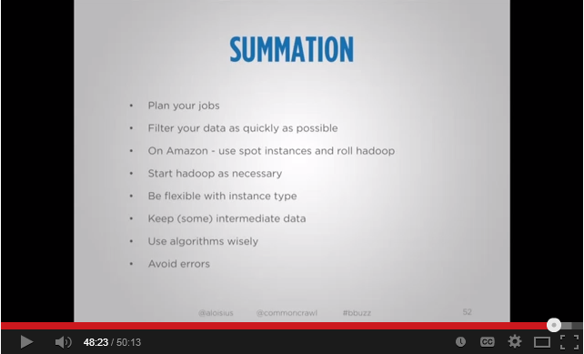
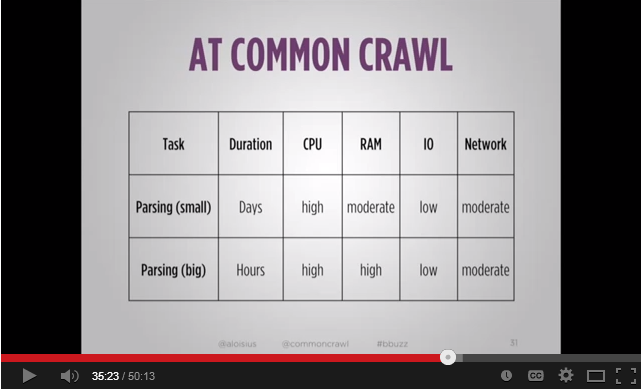
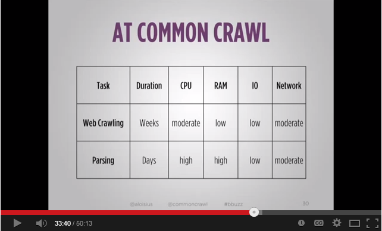

Title: Exploring Common Crawl
Date: 2013-12-16 10:20
Category: Open Collaboration and Peer Production
Tags: pelican, publishing
Slug: commoncrawl
Author: Renu Bora
Summary: Assignment 7

ASSIGNMENT 7: Does your project's community mirror the technical modularity of the project? How does it structure its collaboration--synchronously? Asyncronously? How does it get work done?
The community (to the extent that there is one) is quite asynchronous. They mainly seem to communicate via forums. For the more major contributors (some volunteers are placed on the staff listing because of their importance), presumably they use normal private communication channels. It is not documented how exactly they work, or what community or “open collaboration” community methods they may have used. However, Common Crawl actually increasingly interfaces with other technologies, and their respective communities. Common Crawl now uses Apache Nutch as the basis for its web crawling engine. The project leader of Nutch has participated in their forum, so he may be a regular community member. It also changed the data formats for its 2013 crawl, from ARC and JSON to WARC (ISO 28500) and WET. Those changes are to keep up with the prevalent international industry standards for web data archiving as they emerge. Again, the work behind these decisions and implementations seem done internally by the staff leaders. However, when the 2013 crawl was released, and one user had problems, the CTO of Common Crawl responded and fixed the problem (on Thanksgiving!). So their Google group forum does seem to be sufficient for some collaboration. This case shows that the user community helps with bug-testing in virtue of reporting their problems. Users help each other, and also themselves sometimes, which builds the QA resource. The President, Lisa Green, and also the CTO, Jordan Mendelson, seem fairly active answering questions on the forum.
One interesting community benefit (which could be a constraint at some point), is in Common Crawl’s usage of various products such as Amazon’s AWS, Hadoop, and Nutch. Common Crawl’s CTO, Jordan Mendelson, created an interesting contribution to these communities (big data cloud users in general), via an instructional video. The video was to help people control costs on AWS and other cloud platforms when using big data, and he used his Common Crawl work as his case study (the video benefits both the Common Crawl and the general big data community). This video “[Big Data for Cheapskates]”( https://www.youtube.com/watch?v=vWa9CUsNzdw ) shared methods and design of his entire data production and management process. I list three sample slides below. 
 
 
 
 
 
 
 
 

 
Another community benefit that reflect’s Common Crawl’s place in the overall open-source and general big data ecosystem, was created by staff member Steve Salevan. He used Common Crawl as his example in the instructional video: “[MapReduce for the Masses: Zero to Hadoop in Five Minutes with Common Crawl]”
https://www.youtube.com/watch?v=y4GZ0Ey9DVw
The video addresses commonalities of user groups, and more may instructional videos might be create as people use Common Crawl to learn Hadoop, or learn Hadoop to use Common Crawl. Over time, Common Crawl’s typical platform uses may generate more cross-fertilization of big data users, and possibly create more platform synergies since the open standards make the dataset fairly modular. The research and field (as well as web data itself) are growing so rapidly, there may be more synergies and specializations that are hard to predict. 

[Big Data for Cheapskates]: https://www.youtube.com/watch?v=vWa9CUsNzdw
[MapReduce for the Masses: Zero to Hadoop in Five Minutes with Common Crawl]”: https://www.youtube.com/watch?v=y4GZ0Ey9DVw